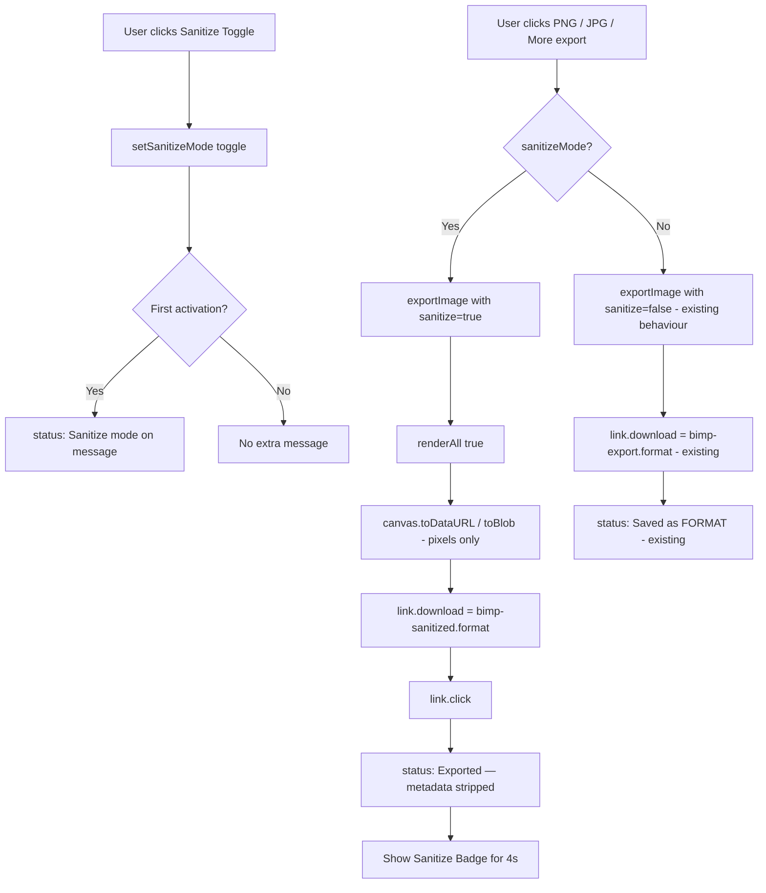

# Design Document: Metadata Scrubbing

## Overview

The Metadata Scrubbing feature adds an explicit "Sanitize" export mode to the bimp.us browser-based image editor. The core insight is that `canvas.toDataURL()` — already used by the existing export path — inherently strips all EXIF, GPS, XMP, IPTC, and ICC metadata because the canvas only holds raw pixel data. The feature therefore does not need to implement any new stripping logic; it needs to make the existing behaviour **visible, verifiable, and trustworthy** through UI affordances.

The design adds:
- A `sanitizeMode` boolean state variable
- A Sanitize Toggle rendered in the top bar alongside the existing export buttons
- Modified `exportImage()` behaviour when sanitize mode is active (different filename, status message, badge)
- A transient Sanitize Badge that confirms the export was metadata-free
- Tooltip text on export buttons when sanitize mode is active
- Accessibility attributes throughout

No server-side changes, no new dependencies, no build step required. All changes are confined to `editor.js`.

---

## Architecture

The application is a single-file React app loaded via CDN (no build step). All state lives in the single `App` component via `useState` hooks. The design follows the same pattern already used for every other feature in the file.



The sanitize path is a thin wrapper around the existing `exportImage` function — the canvas pipeline is identical; only the filename and post-export messaging differ.

---

## Components and Interfaces

### State additions

```js
const [sanitizeMode, setSanitizeMode] = useState(false);
const [showSanitizeBadge, setShowSanitizeBadge] = useState(false);
const [sanitizeFirstUse, setSanitizeFirstUse] = useState(true); // tracks first activation per session
```

### Modified `exportImage(format, sanitize)`

The existing `exportImage` function gains an optional `sanitize` parameter (defaults to `false` to preserve all existing call sites):

```js
const exportImage = (format = "png", sanitize = false) => {
  renderAll(true);
  const canvas = canvasRef.current;
  const link = document.createElement("a");
  const mimeMap = { png:"image/png", jpg:"image/jpeg", jpeg:"image/jpeg", webp:"image/webp", bmp:"image/bmp" };
  const mime = mimeMap[format] || "image/png";
  const quality = (format === "jpg" || format === "jpeg" || format === "webp") ? 0.95 : undefined;
  link.href = canvas.toDataURL(mime, quality);
  link.download = sanitize ? `bimp-sanitized.${format}` : `bimp-export.${format}`;
  link.click();
  renderAll(false);
  if (sanitize) {
    status("🛡 Exported — metadata stripped");
    setShowSanitizeBadge(true);
    setTimeout(() => setShowSanitizeBadge(false), 4000);
  } else {
    status(`⬇ Saved as ${format.toUpperCase()}`);
  }
};
```

All existing call sites (`exportImage("png")`, `exportImage("jpg")`, etc.) continue to work unchanged because `sanitize` defaults to `false`.

### Sanitize Toggle component (inline JSX)

Rendered inside the top-bar export button group, immediately before the `⬇ PNG` button:

```jsx
/* Sanitize Toggle */
React.createElement("label", {
  style: {
    display: "flex", alignItems: "center", gap: 6, cursor: "pointer",
    padding: "4px 10px", borderRadius: 7,
    border: `1px solid ${sanitizeMode ? BRAND.success : BRAND.border}`,
    background: sanitizeMode ? `${BRAND.success}18` : "transparent",
    fontSize: 12, color: sanitizeMode ? BRAND.success : BRAND.textMuted,
    transition: "all 0.15s", userSelect: "none", minWidth: 0,
  },
  title: "Strips EXIF, GPS, author, and all embedded metadata from the exported file",
},
  React.createElement("input", {
    type: "checkbox",
    checked: sanitizeMode,
    "aria-label": "Sanitize export: strip all metadata",
    "aria-checked": sanitizeMode,
    onChange: () => {
      const next = !sanitizeMode;
      setSanitizeMode(next);
      if (next && sanitizeFirstUse) {
        status("🛡 Sanitize mode on — EXIF, GPS & author data will be stripped on export");
        setSanitizeFirstUse(false);
      }
    },
    style: { accentColor: BRAND.success, cursor: "pointer" }
  }),
  "🛡 Sanitize"
)
```

### Sanitize Badge component (inline JSX)

Rendered inside the top-bar, adjacent to the status message area, visible only when `showSanitizeBadge` is true:

```jsx
showSanitizeBadge && React.createElement("div", {
  role: "status",
  "aria-live": "polite",
  style: {
    fontSize: 12, fontWeight: 700,
    color: BRAND.success,
    background: `${BRAND.success}18`,
    border: `1px solid ${BRAND.success}`,
    borderRadius: 6, padding: "3px 10px",
    display: "inline-flex", alignItems: "center", gap: 5,
  }
}, "🛡 Sanitized — no metadata")
```

### Export button tooltip wiring

When `sanitizeMode` is true, the `title` prop on each export button is overridden:

```js
const exportTitle = (label) =>
  sanitizeMode ? "This export will strip all metadata" : label;
```

Applied to the PNG button, JPG button, and each item in the More ▾ dropdown.

### Export call sites

All export call sites pass `sanitizeMode` as the second argument:

```js
onClick: () => exportImage("png", sanitizeMode)
onClick: () => exportImage("jpg", sanitizeMode)
onClick: () => { exportImage(fmt, sanitizeMode); setSaveAsOpen(false); }
```

---

## Data Models

No new persistent data structures are required. All state is ephemeral React state that resets on page reload, consistent with the rest of the application.

| State variable | Type | Default | Purpose |
|---|---|---|---|
| `sanitizeMode` | `boolean` | `false` | Whether sanitize export is active |
| `showSanitizeBadge` | `boolean` | `false` | Controls badge visibility (auto-clears after 4 s) |
| `sanitizeFirstUse` | `boolean` | `true` | Tracks whether the first-activation message has been shown this session |

---

## Correctness Properties

*A property is a characteristic or behavior that should hold true across all valid executions of a system — essentially, a formal statement about what the system should do. Properties serve as the bridge between human-readable specifications and machine-verifiable correctness guarantees.*

### Property 1: Toggle round-trip preserves state

*For any* initial sanitize toggle state, toggling it twice (on then off, or off then on) should return the toggle to its original state.

**Validates: Requirements 1.4, 5.2**

---

### Property 2: Toggle state persists across format selections

*For any* sequence of format selections (PNG, JPG, WebP, BMP) within a session, the sanitize toggle state should remain unchanged after each format selection.

**Validates: Requirements 1.5**

---

### Property 3: Sanitized export filename follows the pattern for all formats

*For any* supported export format (png, jpg, webp, bmp), when sanitize mode is active, the downloaded file's name should be `bimp-sanitized.<format>`.

**Validates: Requirements 2.2**

---

### Property 4: Non-sanitized export filename follows the existing pattern for all formats

*For any* supported export format (png, jpg, webp, bmp), when sanitize mode is inactive, the downloaded file's name should be `bimp-export.<format>`.

**Validates: Requirements 2.4**

---

### Property 5: Quality settings are identical regardless of sanitize state

*For any* supported export format, the MIME type and quality parameter passed to `canvas.toDataURL()` should be identical whether sanitize mode is on or off.

**Validates: Requirements 2.5**

---

### Property 6: Export button tooltips reflect sanitize state for all buttons

*For any* export button (PNG, JPG, WebP, BMP), when sanitize mode is active, the button's `title` attribute should contain "This export will strip all metadata".

**Validates: Requirements 3.2**

---

### Property 7: aria-checked always reflects actual toggle state

*For any* sanitize toggle state (true or false), the `aria-checked` attribute on the toggle element should equal the boolean state value.

**Validates: Requirements 5.1**

---

### Property 8: Keyboard toggle is a round-trip

*For any* initial sanitize state, pressing Space (or Enter) on the focused toggle should change the state, and pressing again should return to the original state.

**Validates: Requirements 5.2**

---

## Error Handling

This feature has a narrow error surface because it delegates entirely to the existing canvas pipeline:

| Scenario | Handling |
|---|---|
| `canvas.toDataURL()` throws (e.g. tainted canvas from cross-origin image) | The existing error path already handles this; no new handling needed. The sanitize path uses the same call. |
| `setTimeout` for badge dismissal is cleared by component unmount | React state updates after unmount are benign no-ops in this context (no async data fetching). |
| User rapidly toggles sanitize mode | Each toggle call is synchronous state update; React batches these correctly. No debounce needed. |
| `sanitizeFirstUse` message shown when image is not loaded | The toggle is only rendered when `image` is truthy (same condition gate as the export buttons), so this cannot occur. |

---

## Testing Strategy

### Context

This is a plain HTML/JS file with React loaded via CDN and no existing test infrastructure. The testing strategy must be pragmatic: the correctness properties above define *what* to verify; the implementation approach must match the project's zero-build-step constraint.

### Recommended approach: Vitest + jsdom

Add Vitest (or Jest) as a dev dependency with jsdom for DOM simulation. The `editor.js` file exports nothing today, but the pure logic under test (filename generation, state transitions) can be extracted into small testable functions or tested by importing the transpiled module.

A simpler alternative for this project: extract the two pure functions that are most critical into a separate `utils.js` file and test those directly.

**Pure functions to extract and test:**

```js
// utils.js
export function exportFilename(format, sanitize) {
  return sanitize ? `bimp-sanitized.${format}` : `bimp-export.${format}`;
}

export function exportQuality(format) {
  return (format === "jpg" || format === "jpeg" || format === "webp") ? 0.95 : undefined;
}

export function exportMime(format) {
  const mimeMap = { png:"image/png", jpg:"image/jpeg", jpeg:"image/jpeg", webp:"image/webp", bmp:"image/bmp" };
  return mimeMap[format] || "image/png";
}
```

### Property-based tests

Use [fast-check](https://github.com/dubzzz/fast-check) for property-based testing. Each property test runs a minimum of 100 iterations.

```js
// Feature: metadata-scrubbing, Property 3: Sanitized export filename follows the pattern for all formats
fc.assert(fc.property(
  fc.constantFrom("png", "jpg", "webp", "bmp"),
  (format) => exportFilename(format, true) === `bimp-sanitized.${format}`
), { numRuns: 100 });

// Feature: metadata-scrubbing, Property 4: Non-sanitized export filename follows the existing pattern for all formats
fc.assert(fc.property(
  fc.constantFrom("png", "jpg", "webp", "bmp"),
  (format) => exportFilename(format, false) === `bimp-export.${format}`
), { numRuns: 100 });

// Feature: metadata-scrubbing, Property 5: Quality settings are identical regardless of sanitize state
fc.assert(fc.property(
  fc.constantFrom("png", "jpg", "webp", "bmp"),
  (format) => exportQuality(format) === exportQuality(format) // same result regardless of sanitize
), { numRuns: 100 });
```

### Unit / example-based tests

Cover the specific-value requirements that are not amenable to property testing:

- Toggle renders with correct label text "Sanitize (strip metadata)"
- Toggle defaults to `checked=false` on first render
- Activating toggle applies `BRAND.success` colour to border/background
- Status bar shows exact string "🛡 Exported — metadata stripped" after sanitized export
- Status bar shows exact string "🛡 Sanitize mode on — EXIF, GPS & author data will be stripped on export" on first activation
- Badge is hidden when sanitize mode is off
- Badge shows "🛡 Sanitized — no metadata" after sanitized export
- Badge has `role="status"` and `aria-live="polite"`
- Toggle has `aria-label="Sanitize export: strip all metadata"`
- Toggle has `title` attribute with the full disclosure text
- Toggle font size is ≥ 12px

### Manual smoke tests

Because the canvas pipeline cannot be meaningfully unit-tested without a real browser:

1. Load a JPEG with GPS data (e.g. a phone photo) into the editor
2. Export without sanitize — open in ExifTool or browser DevTools and confirm EXIF is absent (canvas already strips it)
3. Enable sanitize toggle — confirm visual state change (green border)
4. Export PNG — confirm filename is `bimp-sanitized.png`, status bar shows shield message, badge appears for ~4 s
5. Export JPG — confirm filename is `bimp-sanitized.jpg`
6. Disable sanitize — confirm filename reverts to `bimp-export.png`
7. Tab to toggle, press Space — confirm state toggles; press Space again — confirm it returns
8. Run a screen reader (VoiceOver / NVDA) and verify badge announcement on export
